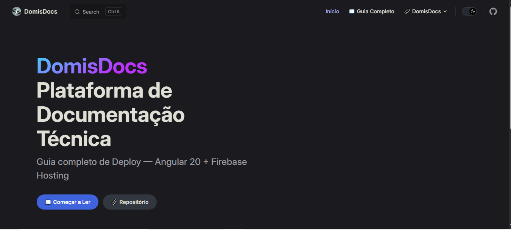

<h1 id="-domisdocs">🚀 DomisDocs — Guia: Deploy de Angular 20 no Firebase Hosting</h1>


[](https://github.com/Domisnnet/DomisDocs/blob/main/license)


> **Plataforma de Documentação Técnica — DomisDocs:**
> Guia completo e testado para conectar uma aplicação **Angular 20** a um projeto existente no **Firebase** e publicá-la utilizando o **Firebase Hosting**.
> **Projeto de referência:** **Shadow-Flip-Angular**
> **Nível:** Intermediário → Avançado
> **Última atualização:** agosto de 2026

Bem-vindo à **Plataforma de Documentação Técnica Profissional DomisDocs!!**. Esta aplicação é uma **referência técnica** desenvolvida com **VitePress / Vue**, destinada a documentar o processo de integração entre uma Linguagem de Programação e/ou Framework — utilizando como exemplo **Angular 20.**

O projeto nasceu de um **problema real** enfrentado ao conectar uma aplicação ao **Firebase Hosting**. Resolvi então documentar um **passo a passo prático e direto ao ponto**, registrando a solução e todos os cuidados necessários para essa integração.

---

## 📚 Tabela de Conteúdo
| 💻 O Projeto | 🛠️ Técnico | 🤝 Comunidade |
| :---: | :---: | :---: |
| [](#sobre-o-projeto) | [](#destaques-tecnicos) | [](#codigo-fonte) |
| [](#tecnologias-utilizadas) | [](#fluxo-de-deploy) | [](#créditos) |
| [](#como-acessar) | [](#como-contribuir) | [](#licenca) |
| [](#funcionalidades) | [](#faq) | [](#perfil-do-github) |

---

<h2 id="sobre-o-projeto">1. 🚀 Sobre o Projeto</h2>

Este guia mostra como conectar um projeto **Angular 20 existente** a um projeto já criado no **Firebase** e publicá-lo utilizando o **Firebase Hosting**. O projeto de referência utilizado como exemplo é o **Shadow-Flip-Angular**. Mas vale salientar que esse mesmo procedimento é válido , para conectar qualquer Linguagem de Programação e/ou Framework.

O processo completo inclui: instalação do Firebase CLI, autenticação, associação do projeto, geração de build, configuração de SPA e publicação em produção.

> ⚠️ Considera aplicação Angular client-side/SPA. Projetos com SSR podem exigir configuração diferente.

---

<h2 id="tecnologias-utilizadas">2. ⚙️ Tecnologias Utilizadas</h2>

| Camada | Tecnologias | Descrição |
| :--- | :--- | :--- |
| **Core** |  | Framework de aplicação SPA. |
| **Hosting** |  | Hospedagem de sites estáticos com CDN global. |
| **Ferramentas** |   | Requisitos de build e deploy. |

---

<h2 id="como-acessar">3. 🚀 Como Acessar</h2>

Após o deploy bem-sucedido, sua aplicação estará disponível na "Plataforma" clicando no botão abaixo:

<div align="left">
  <a href="https://domisdocs-602fc.web.app/" target="_blank">
    
  </a>
</div>

---

<h2 id="funcionalidades">4. 🧩 Funcionalidades</h2>

| Funcionalidade | Descrição |
| :--- | :--- |
| ⚡ **Build Automatizado** | Compilação com `ng build --configuration production` para arquivos otimizados. |
| 📁 **Pasta Correta** | Identificação exata de onde está o `index.html` dentro de `dist/`. |
| 🔄 **SPA Amigável** | Regra de `rewrites` configurada → rotas internas sem erro 404. |
| 🚀 **Deploy em Um Comando** | Publicação direta com `firebase deploy --only hosting`. |
| ✅ **Validação Local** | Teste com emulador antes de publicar em produção. |

---

<h2 id="destaques-tecnicos">5. 💻 Destaques Técnicos</h2>

### 📐 Estrutura de Pastas
O Angular 20 gera o build em `dist/nome-do-projeto/browser/`. É **fundamental** que `firebase.json`aponte para essa pasta, e não para a raiz de `dist/` nem para o próprio arquivo `index.html`.

### 🔄 Regra de Rewrites
Para SPA, todas as requisições devem ser encaminhadas ao `index.html`:
```json
"rewrites": [{"source": "**", "destination": "/index.html"}]
```
Sem isso, ao atualizar página em rota interna → **erro 404**.

---

<h2 id="fluxo-de-deploy">6. 📦 Fluxo de Deploy</h2>

### 1. Verificar versões

O deploy da aplicação utiliza Firebase Hosting integrado ao GitHub.
Para verificar a versão basta executar:
```bash
node --version
ng version
firebase --version
```

### 2. Autenticar e selecionar projeto
```bash
firebase login
firebase use --add
```

### 3. Gerar build de produção
```bash
ng build --configuration production
```

### 4. Configurar Hosting (1ª vez)
```bash
firebase init hosting
```

### 5. Publicar
```bash
firebase deploy --only hosting
```

> ⚡ Para próximas publicações: `ng build --prod && firebase deploy --only hosting`

---

<h2 id="como-contribuir">7. 🤝 Como Contribuir</h2>

| Fase | Ação | Link / Comando |
| :---: | :--- | :--- |
| **01** | **Fork** | [](https://github.com/Domisnnet/DomisDocs/fork) |
| **02** | **Branch** | `git checkout -b feature/Melhoria` |
| **03** | **Commit** | `git commit -m 'docs: atualizado passo a passo'` |
| **04** | **Push** | `git push origin feature/Melhoria` |
| **05** | **PR** | [](https://github.com/Domisnnet/DomisDocs/compare)

### 🐛 Encontrou um problema?
Se algo não estiver funcionando como esperado, não hesite em abrir um chamado:

[](https://github.com/Domisnnet/DomisDocs/issues)
[](https://github.com/Domisnnet/DomisDocs/issues/new)

---

<h2 id="faq">8. 🧠 Perguntas Frequentes</h2>

<details>
<summary><strong>Por que rodar <code>ng build</code> antes do deploy?</strong></summary>
O Firebase Hosting só hospeda arquivos estáticos. O build compila o Angular para dentro de <code>dist/</code>, que é a pasta enviada ao servidor.
</details>

<details>
<summary><strong>Por que a pasta <code>browser</code> existe dentro de dist?</strong></summary>
É a estrutura padrão do Angular 20 para SPA. Sempre confirme o caminho real do <code>index.html</code> — nunca presuma!
</details>

<details>
<summary><strong>Para que serve o <code>rewrites</code> no firebase.json?</strong></summary>
Encaminha todas as URLs para o <code>index.html</code>, permitindo que o Angular Router funcione sem erro 404 ao recarregar.
</details>

<details>
<summary><strong>Preciso de Firestore ou Functions para hospedar?</strong></summary>
Não! Para hospedar uma SPA basta o Firebase Hosting. Os demais serviços são totalmente opcionais.
</details>

<details>
<summary><strong>Alterações não aparecem — o que fazer?</strong></summary>
Confirme: rodou o build ANTES do deploy? Atualize com Ctrl+F5? Teste em janela anônima? Cache pode atrasar.
</details>

---

<h2 id="codigo-fonte">9. 💻 Código Fonte</h2>

Explore a documentação completa no repositório oficial:


[](https://github.com/Domisnnet/DomisDocs)

---

<h2 id="créditos">10. 📝 Créditos</h2>

| Atribuição | Responsável / Recurso | Descrição |
| :--- | :--- | :--- |
| **Documentação** | **DomisDev** | Guia elaborado e testado passo a passo. |
| **Infraestrutura** | **Google Firebase** | Plataforma de hospedagem e serviços cloud. |
| **Framework** | **Angular** | Plataforma de desenvolvimento SPA. |
| **Referência** | **Shadow-Flip-Angular** | Projeto real utilizado como exemplo. |

---

<h2 id="licenca">11. 📄 Licença</h2>

Este projeto está sob a: &nbsp; [](https://github.com/Domisnnet/DomisDocs/blob/main/license) — livre uso mantendo os créditos.

---

<h2 id="perfil-do-github">12. 👨‍💻 Perfil do GitHub</h2>

<a href="https://github.com/Domisnnet">
  
</a>

&nbsp;
<p align="center">
  <a href="#-domisdocs">
    
  </a>
</p>